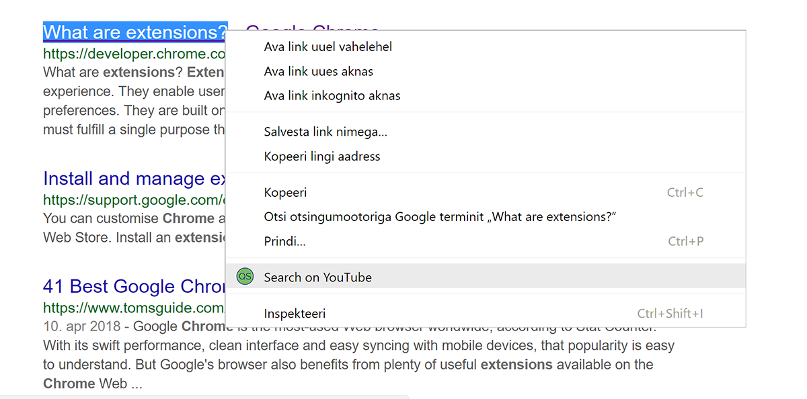
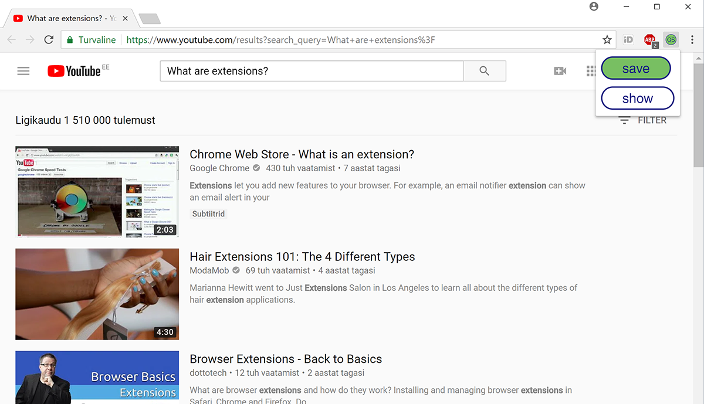

# 3. kodutöö – Chrome extension

Töö autorid:

Tauri Taevik
Robert Shevchenko
Kert Tamm

Antud Chrome extension võimaldab kiirelt salvestada kõik avatud tabid ning võimaldab salvestatud tabid kiirelt avada uues aknas.
Lisaks võimaldab highlighted teksti kiirelt youtubeist otsida.

Kasutatud viited:
  Tabide salvestamine/avamine
  https://stackoverflow.com/questions/6132018/how-can-i-get-the-current-tab-url-for-chrome-extension
  https://developer.chrome.com/extensions/storage
  https://developer.chrome.com/extensions/windows
  https://developer.chrome.com/extensions/tabs#type-Tab

  CSS:
  https://www.sitepoint.com/modern-css-buttons

  YouTubei otsing:
  https://stackoverflow.com/questions/49049486/chrome-extension-unable-to-open-pop-up-page-from-context-manu
  https://developer.chrome.com/apps/contextMenus#event-onClicked

